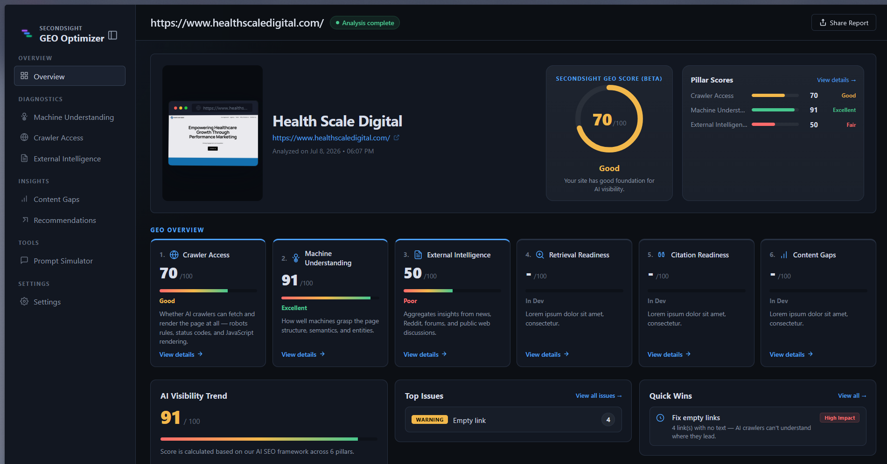

# SecondSight GEO Optimizer

<div align="center">
  
  <br/>
  <h3>The ultimate AI & Generative Engine Optimization (GEO) Analysis Workspace</h3>
</div>

<br/>



## Overview

SecondSight GEO Optimizer is a professional-grade, dark-themed diagnostic dashboard built to evaluate how AI agents, large language models (LLMs), and traditional web crawlers interpret digital content. It shifts the focus from traditional SEO to **Generative Engine Optimization (GEO)** by simulating machine interpretation across multiple vectors.

## Key Features

- **Machine Understanding:** Real-time progressive timeline analyzing identity, document structure, primary content intent, extracted knowledge entities, and accessibility blockages.
- **Crawler Access:** In-depth diagnostics for `robots.txt` compliance, sitemap parsing, indexability, and server response readiness.
- **External Intelligence:** An aggregated view of an entity's digital footprint across the web, including real-time sentiment analysis, Reddit discussions, and recent news mentions.
- **Premium UI/UX:** Built with a sophisticated, highly-polished dark mode interface utilizing modern CSS techniques, glassmorphism, and responsive CSS Grid architecture.

## Tech Stack

- **Frontend:** React, Vite, React Router
- **Backend:** Node.js, Express (API layer for simulations and crawling)
- **Browser Automation:** Playwright
- **Containerization:** Docker
- **Deployment:** Railway
- **Styling:** Custom Vanilla CSS with a bespoke design system

## Frontend Structure

The frontend is organized by feature so each route's UI, helpers, and styles stay together:

```text
src/
├── components/
│   ├── common/                  # Reusable UI and shared presentation helpers
│   ├── icons/                   # Shared application icons
│   ├── overview/                # Overview route, model, and styles
│   ├── machine-understanding/   # Machine analysis route, fixes, helpers, and styles
│   ├── crawler-access/          # Crawler diagnostics route, helpers, and styles
│   ├── external-intelligence/   # External intelligence route and styles
│   └── settings/                # Settings route
├── layout/                      # Application shell, sidebar, header, and layout styles
├── hooks/                       # Cross-feature React hooks
├── styles/                      # Global styles and Tailwind entrypoint
├── utils/                       # Cross-feature data utilities
├── App.jsx                      # Shared analysis state and route rendering
├── navigation.jsx               # Route and sidebar configuration
└── main.jsx                     # Browser entrypoint
```

## Getting Started

### Prerequisites

- Node.js (v16 or higher)
- npm or yarn
- Docker (optional, recommended for production deployment)

### Installation

1. Clone the repository:

   ```bash
   git clone https://github.com/HSDLabs/secondSight-geo-optimizer.git
   cd secondSight-geo-optimizer
   ```

2. Install dependencies:

   ```bash
   npm install
   ```

## Running Locally (Development)

Start both the frontend and backend services.

```bash
npm run dev:all
```

This starts:

- Vite development server: `http://localhost:5173`
- Express API server

Alternatively, you can run them separately:

```bash
npm run server
```

```bash
npm run dev
```

## Running with Docker

Build the Docker image:

```bash
docker build -t secondsight .
```

Run the container:

```bash
docker run --rm -p 3000:3000 --env-file server/.env secondsight
```

Then open:

```
http://localhost:3000
```

## Deployment

SecondSight is designed to be deployed using Docker on Railway.

The Docker image:

- Builds the Vite frontend into the `dist` directory.
- Serves the compiled frontend through the Express server.
- Includes Playwright and all required browser dependencies using the official Playwright Docker image.
- Provides a consistent runtime environment between local development and production deployments.

## Architecture & Workflows

SecondSight is designed around an extensible modular architecture:

- **Services (`/server/services/`)**: Independent modules for crawling, external web intelligence, and AI processing.
- **Layers (`/server/services/layers/`)**: Granular heuristic extractors (accessibility, links, content structure).
- **UI Architecture (`/src/`)**: Compartmentalized React components broken down by analysis pillar.

## Contributing

1. Fork the project
2. Create your feature branch (`git checkout -b feature/AmazingFeature`)
3. Commit your changes (`git commit -m 'Add some AmazingFeature'`)
4. Push to the branch (`git push origin feature/AmazingFeature`)
5. Open a Pull Request
